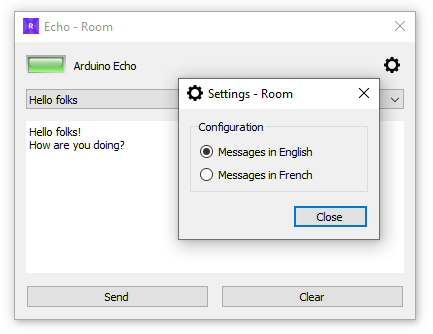
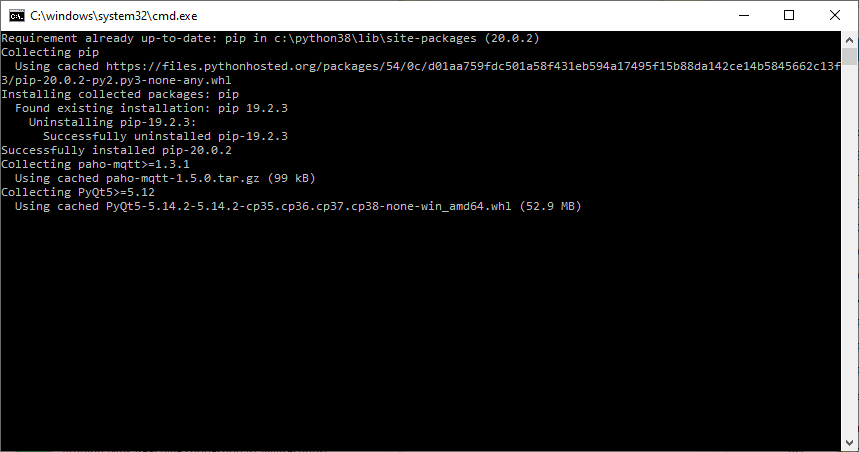
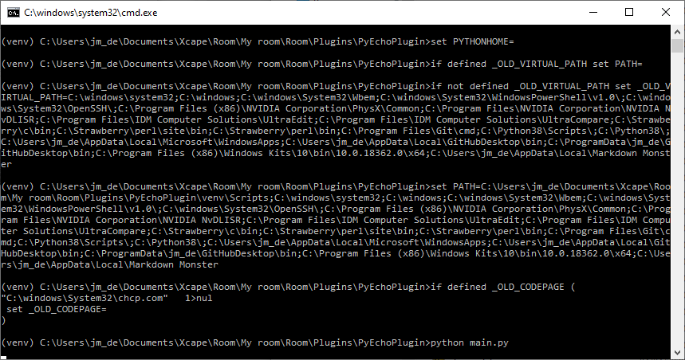
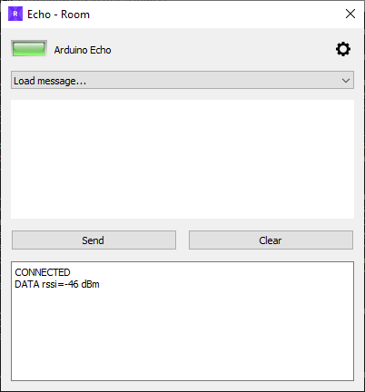

# PyEchoPlugin
 ***Source code for the Room plugin tutorial.***
 
Go to the <a href="https://xcape.io/public/documentation/en/room/Plugintutorial.html" target="_blank">**Room** plugin tutorial</a>. 

The plugin tutorial is illustrated with:
* this PyEchoPlugin
* the <a href="https://github.com/fauresystems/PyEchoProps" target="_blank">PyEchoProps</a>
* the <a href="https://github.com/xcape-io/PyEchoPlugin/tree/master/ArduinoEchoProps" target="_blank">ArduinoEchoProps</a>




## Installation
Download `PyEchoPlugin-master.zip` from this GitHub repository and unflate it in Room/Plugins/PyEchoPlugin directory in **Room** software installation folder.

Edit `definitions.ini` to set MQTT topics for your Escape Room:
```python
[mqtt]
mqtt-pub-props = Room/My room/Props/Arduino Echo/inbox
mqtt-sub-props = Room/My room/Props/Arduino Echo/outbox
mqtt-sub-control-administrator = Room/My room/Control/administrator

``` 

Run installer (double-click on `install.bat`):



If Windows Defender SmartScreen blocks execution, click **More info** and **Run anyway**

Run test (double-click on `test.bat`):





If the plugin poped-up your installation is correct.


## Author

**Faure Systems** (Mar 20th, 2020)
* company: FAURE SYSTEMS SAS
* mail: *dev at faure dot systems*
* github: <a href="https://github.com/fauresystems?tab=repositories" target="_blank">fauresystems</a>
* web: <a href="https://faure.systems/" target="_blank">Faure Systems</a>